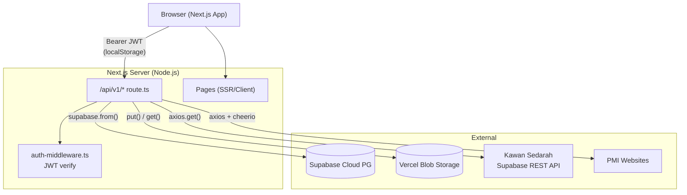
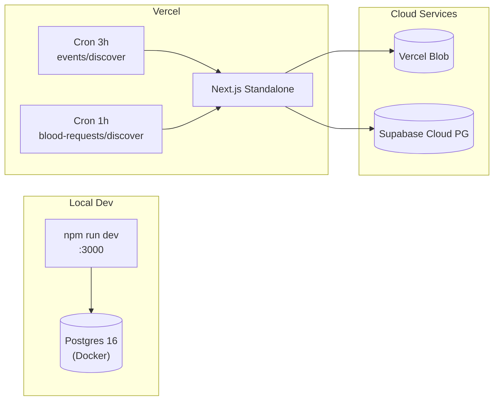

# Architecture — AmbilDarahku

## High-Level Architecture



## Application Architecture

### Layer Pattern (per API route)

```
Request → requireAuth() → checkVerifiedEmail() → handler()
                                                      │
                                         supabase.from("table")
                                              .select/insert/update
                                              .eq("id", id)
                                              .maybeSingle()
```

No service/repository layers — handlers query Supabase directly. Auth logic extracted to `auth-middleware.ts`. Discovery runners use `pg` Pool directly (DDL needs raw PostgreSQL).

### Key Library Modules

| Module | Role |
|---|---|
| `db.ts` | Lazy-init Proxy wrapping `@supabase/supabase-js` client. Uses `SUPABASE_SERVICE_KEY` (fallback `NEXT_PUBLIC_SUPABASE_PUBLISHABLE_KEY`). Auth disabled (`autoRefreshToken: false`, `persistSession: false`) |
| `auth-middleware.ts` | `requireAuth()` verifies Bearer JWT via `jsonwebtoken`. Returns `AuthContext` or `NextResponse` (401). `checkVerifiedEmail()` returns 403 for unverified users on protected paths. `checkAdmin()` / `checkPMIOrAdmin()` for role gating |
| `jwt.ts` | `generateAccessToken()` (15m default), `generateRefreshToken()` (7d), `verifyToken()`. Configurable via `JWT_SECRET`, `JWT_ACCESS_EXPIRY`, `JWT_REFRESH_EXPIRY` |
| `password.ts` | `hashPassword()` / `checkPassword()` using bcryptjs with 12 salt rounds |
| `eligibility.ts` | Rule engine: age (18–65), weight (≥50kg), donation interval (≥56 days). Returns `eligible`, `not_eligible`, `waiting_period`, `needs_clearance` |
| `trust-score.ts` | Weighted calculation: donation count (30%), verification level (30%), claim accuracy (20%), profile completeness (10%), account age (10%) |
| `file.ts` | `uploadFile()` → Vercel Blob `put()` (private), `deleteFile()`, `getFileUrl()` → proxy path |
| `api.ts` | Client HTTP client. Auto-refreshes on 401, redirects on 403 "email not verified" |
| `email.ts` | SMTP via nodemailer. HTML templates for verification + password reset |
| `auth-context.tsx` | React Context wrapping app. Provides `user`, `loading`, `isAdmin`, `isUnverified`, `login()`, `register()`, `logout()`, `refreshUser()`. Tokens in localStorage |
| `event-discovery/runner.ts` | `discoverEvents()` — orchestrates fetching from 7 sources, dedup, image download, insert |
| `blood-request-discovery/runner.ts` | `discoverBloodRequests()` — fetches from external Supabase REST API, maps fields, upserts |

## Auth Flow

```
Register:
  POST /api/v1/auth/register
  → bcrypt(password) → INSERT users → generateAccessToken + generateRefreshToken
  → { user, access_token, refresh_token }

Login:
  POST /api/v1/auth/login
  → SELECT user → checkPassword → generateAccessToken + generateRefreshToken (SHA-256 hash in refresh_tokens)
  → { user, access_token, refresh_token }

Refresh:
  POST /api/v1/auth/refresh
  → SHA-256(refresh_token) → match in refresh_tokens → DELETE old → issue new pair (rotation)
  → { user, access_token, refresh_token }

Protected request:
  api.ts → GET /api/v1/* (Authorization: Bearer <access_token>)
  → requireAuth() → verifyToken(access_token) → if expired → 401
  → api.ts catches 401 → attemptRefresh() → retry original request
  → if refresh fails → localStorage.clear() → redirect /login

Email verification:
  POST /api/v1/auth/verify-email (token from verification_tokens)
  → UPDATE users SET email_verified = true
```

## Frontend Architecture

```
Root Layout (layout.tsx)
  ├── AuthProvider (React Context)
  ├── DesktopSidebar (md+ breakpoint, hidden mobile)
  ├── <main> {children} </main>
  ├── BottomNav (mobile fixed, md:hidden)
  └── Toaster (sonner notifications)

Pages (31 page.tsx):
  Public (SSR):        /, /privacy, /terms
  Public (client):     /login, /register, /forgot-password, /reset-password, /verify-email
  Public SSR (data):   /u/[username], /passport/verify/[token]
  Authenticated:       /search, /profile, /donor-history
  Requests:            /requests, /requests/new, /requests/share/[id]
  Passport:            /passport
  Events:              /events, /events/new, /events/archive
  Admin:               /admin, /admin/analytics, /admin/claims, /admin/verifications, /admin/awards
  Other:               /leaderboard, /claims, /claims/new, /verification, /timeline, /recognition (301→/passport)
```

## Domains

### Auth Domain
- Routes: `auth/register`, `auth/login`, `auth/me`, `auth/logout`, `auth/refresh`, `auth/change-password`, `auth/resend-verification`, `auth/verify-email`, `auth/forgot-password`, `auth/reset-password`
- Tables: `users`, `refresh_tokens`, `verification_tokens`

### Donor Domain
- Routes: `donors`, `donor-history`, `donor-history/[id]`, `donor-status`, `donor-verification`
- Tables: `users`, `donor_histories`, `donor_verifications`

### Blood Request Domain
- Routes: `requests`, `requests/mine`, `requests/[id]`, `requests/[id]/fulfill`, `requests/[id]/fulfillments`, `requests/[id]/status`
- Tables: `blood_requests`, `request_fulfillments`

### Blood Request Discovery Domain
- Routes: `blood-requests/discover`
- Source: External Supabase REST API (Kawan Sedarah)
- Flow: Hourly cron → check table count → full seed (if empty) or incremental (`status != Selesai`) → field mapping → upsert via `ON CONFLICT (source_type, source_request_id) DO UPDATE`
- Status guard: local `fulfilled` status never downgraded by API
- Phone normalization: `08xx` → `628xx`, strips dashes/spaces
- `requester_id` set to admin user ID for scraped records

### Event Discovery Domain
- Routes: `events`, `events/discover`, `events/archive`, `events/sources`
- Tables: `events`, `event_sources`
- Sources (7): AyoDonor PMI, PMI Bali, 4 PMI cities, REST API (Kawan Sedarah)
- Flow: Cron/Manual → seed sources → scrape each (concurrent 5) → dedup → download images → insert → archive expired → backfill missing posters
- Image pipeline: download `image_url` → `put()` to Vercel Blob with original filename → store blob path in `poster_url`
- Dedup: `(source_type, source_id)` unique index, `ON CONFLICT DO NOTHING`
- Fallback image: Gemini image when no `poster_url` exists

### Passport Domain
- Routes: `passport`, `passport/[username]`, `passport/request`, `passport/renew`, `passport/verify/[token]`
- Tables: `donor_passports`, `user_badges`, `user_titles`, `badges`
- Format: `ADK-YYYY-NNNNNN`

### Claims & Verification Domain
- Routes: `claims`, `claims/[id]`, `trust-score`, `trust-score/refresh`, `trust-score/[username]`, `recognition`, `recognition/[username]`
- Tables: `donation_claims`, `award_configs`, `user_titles`

### Admin Domain
- Routes: `admin/stats`, `admin/users`, `admin/users/[id]/role`, `admin/verifications`, `admin/verifications/[id]/review`, `admin/claims`, `admin/claims/[id]`, `admin/claims/[id]/review`, `admin/awards`, `admin/awards/[id]`, `admin/titles`, `admin/analytics/*` (6 endpoints)
- Access: `super_admin` or `pmi_admin` role

## External Integrations

| Integration | Status | Usage |
|---|---|---|
| Supabase (Cloud PG) | Active | All data storage, query via JS client |
| Vercel Blob | Active | Private file storage, event poster images |
| Kawan Sedarah (Supabase REST) | Active | Scrape events + blood requests from external Supabase instance |
| QR Server (api.qrserver.com) | Active | Generate QR codes for passport + share cards |
| WhatsApp (wa.me) | Active | Share blood request via WhatsApp link |
| SMTP (Brevo) | Active | Verification emails, password reset |
| Redis | Declared only | In docker-compose, zero code usage |

## Infrastructure



### Cron Schedules

| Route | Schedule | Function |
|---|---|---|
| `POST /api/v1/events/discover` | `0 */3 * * *` (every 3h) | Scrape event sources, download posters |
| `POST /api/v1/blood-requests/discover` | `0 * * * *` (every 1h) | Upsert blood requests from external API |

### Docker Compose
3 services: `postgres:16-alpine`, `redis:7-alpine` (unused), `frontend` (node:22-alpine, standalone output, port 3000).

No K8s, no staging environment declared.
