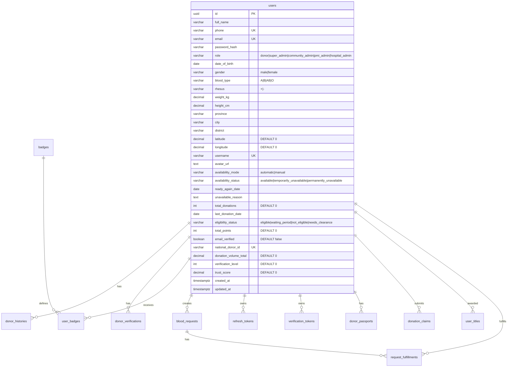

# Database — AmbilDarahku

## Engine

PostgreSQL 16 via `github.com/lib/pq` driver + `github.com/jmoiron/sqlx` wrapper.

## ERD



## Tables (14)

### `users` — Core user/donor entity (30+ columns)

Includes: id (UUID PK), full_name, phone (UNIQUE), email (UNIQUE), password_hash, role, date_of_birth, gender, blood_type, rhesus, weight_kg, height_cm, province, city, district, latitude (DEFAULT 0), longitude (DEFAULT 0), username (UNIQUE nullable), avatar_url (nullable), availability_mode, availability_status, ready_again_date (nullable), unavailable_reason (nullable), total_donations, last_donation_date (nullable), eligibility_status, total_points, email_verified (DEFAULT false), national_donor_id (UNIQUE nullable), donation_volume_total (DEFAULT 0), verification_level (DEFAULT 0), trust_score (DEFAULT 0), created_at, updated_at.

**Indexes**: blood_type, city, eligibility, availability, (lat,lng)

### `donor_histories` — Donation records (14+ cols)

Columns: id, user_id (FK CASCADE), donation_date, location, institution, bags, notes, proof_photo, proof_card, proof_letter, verification_status (pending/verified/rejected), verified_by (FK nullable), verified_at (nullable), claim_id (FK→donation_claims nullable), verification_level (VARCHAR(20) DEFAULT 'self'), verification_source (VARCHAR(100)), created_at.

**Index**: user_id

### `donor_verifications` — Verification requests

Columns: id (UUID PK), user_id (FK CASCADE), level (1/2/3), status (pending/approved/rejected), verifier_id (FK nullable), verifier_role (community/pmi), notes, created_at, updated_at.

### `blood_requests` — Emergency blood requests

Columns: id (UUID PK), requester_id (FK CASCADE), patient_name, hospital, blood_type, rhesus, bags, fulfilled_bags (DEFAULT 0), urgency (critical/urgent/normal), latitude, longitude, city, contact_phone, notes, status (open/fulfilled/cancelled), created_at, updated_at.

**Indexes**: blood_type, urgency, status

### `request_fulfillments` — Donor→Request links

Columns: id (UUID PK), request_id (FK CASCADE), donor_id (FK CASCADE), bags, created_at.

### `badges` — Badge definitions (seeded)

Columns: id (UUID PK), name (UNIQUE), description, icon_url, min_donations, created_at.

Seeded (6): First Drop (1), Lifesaver (5), Hero (10), Guardian (25), Legend (50), Blood Champion (100).

### `user_badges` — User-badge assignments

Columns: id (UUID PK), user_id (FK CASCADE), badge_id (FK CASCADE), awarded_at.

**Unique**: (user_id, badge_id)

### `refresh_tokens` — Auth refresh token storage

Columns: id (UUID PK), user_id (FK CASCADE), token_hash (SHA-256), expires_at, created_at.

### `verification_tokens` — Email verification & password reset

Columns: id (UUID PK), user_id (FK CASCADE), token, type (email_verification/password_reset), expires_at, used_at (nullable), created_at.

### `events` — Blood drive events

Columns: id (UUID PK), title, description, location, city, event_date, start_time, end_time, organizer, contact_phone, quota, banner_url, status (upcoming/ongoing/completed/cancelled), created_at, updated_at.

### `donor_passports` — National donor passport

Columns: id (UUID PK), user_id (FK UNIQUE), passport_number (UNIQUE, ADK-YYYY-NNNNNN), qr_token (UNIQUE, 64-char hex), issued_at, last_renewed_at (nullable), is_active, created_at, updated_at.

### `donation_claims` — Historical donation claims

Columns: id (UUID PK), user_id (FK CASCADE), donation_date, location, institution_name, blood_type, volume_ml, proof_photo_url, proof_document_url, additional_notes, status (pending/approved/rejected), reviewed_by (FK nullable), reviewed_at (nullable), rejection_reason (nullable), created_at, updated_at.

### `award_configs` — Award/title configuration

Columns: id (UUID PK), name, description, award_type (badge/title/certificate), criteria (JSONB), scope (national/regional/city), scope_value (nullable), is_active, created_at, updated_at.

### `user_titles` — Awarded titles

Columns: id (UUID PK), user_id (FK CASCADE), title, awarded_at, source (auto/manual), config_id (FK→award_configs nullable), description (nullable), created_at.

## Data Lifecycle

- **Migrations**: Auto-run at startup via `database.RunMigrations()` — idempotent (CREATE TABLE IF NOT EXISTS + ALTER TABLE ADD COLUMN IF NOT EXISTS)
- **Badges**: Seeded on startup via `BadgeRepository.SeedDefaults()` — idempotent (ON CONFLICT DO NOTHING)
- **Admin user**: Optionally seeded if `SEED_ADMIN_EMAIL` is set (idempotent)
- **Dummy data**: Optional flag `SEED_DUMMY=true` seeds 1,500+ donors, 60 requests, 29 events (runs in background goroutine, ~20min)
- **Cascades**: `ON DELETE CASCADE` on user_id for donor_histories, donor_verifications, user_badges, refresh_tokens, verification_tokens, blood_requests, donor_passports, donation_claims
- **No soft deletes**: No `deleted_at` columns
- **No migration versioning**: Schema changes are stacked idempotent DDL

## Key Query Patterns

```sql
-- Search donors with distance
SELECT *, (6371 * acos(...)) AS distance FROM users
WHERE blood_type = $1 AND city = $2 AND availability_status = $3
ORDER BY distance ASC;

-- National leaderboard
SELECT id, full_name, blood_type, city, total_donations, total_points
FROM users ORDER BY total_points DESC, total_donations DESC LIMIT 100;

-- Open requests sorted by urgency
SELECT * FROM blood_requests WHERE status = 'open'
ORDER BY CASE urgency WHEN 'critical' THEN 0 WHEN 'urgent' THEN 1 ELSE 2 END, created_at DESC;

-- Timeline UNION
(SELECT donation_date, 'donation' as type ... FROM donor_histories)
UNION ALL
(SELECT donation_date, 'claim' as type ... FROM donation_claims)
UNION ALL
(SELECT awarded_at, 'badge' as type ... FROM user_badges)
ORDER BY date DESC LIMIT $1 OFFSET $2;
```
