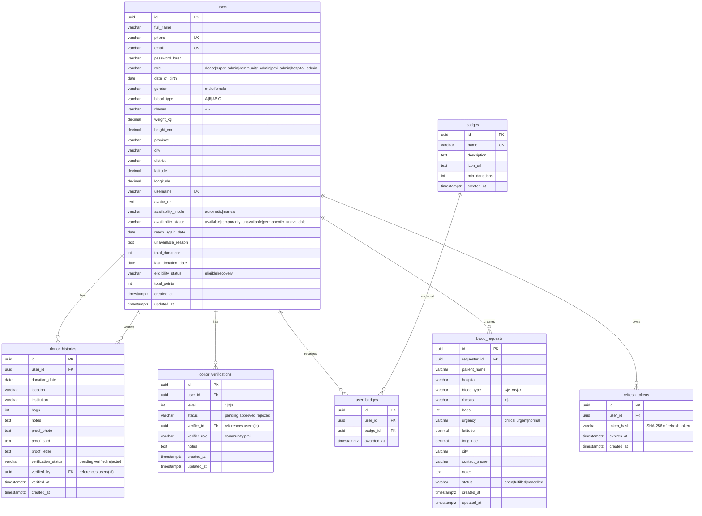

# Database — AmbilDarahku

## Engine

PostgreSQL 16 (via `github.com/lib/pq` driver, `github.com/jmoiron/sqlx` wrapper)

## ERD



## Tables

### `users` — Core user/Donor entity

| Column | Type | Constraints | Notes |
|---|---|---|---|
| id | UUID | PK, default uuid_generate_v4() | |
| full_name | VARCHAR(150) | NOT NULL | |
| phone | VARCHAR(20) | NOT NULL, UNIQUE | WhatsApp number |
| email | VARCHAR(150) | NOT NULL, UNIQUE | |
| password_hash | VARCHAR(255) | NOT NULL | bcrypt hash |
| role | VARCHAR(20) | DEFAULT 'donor', CHECK | 5 roles |
| date_of_birth | DATE | NOT NULL | |
| gender | VARCHAR(10) | NOT NULL, CHECK | 'male'/'female' |
| blood_type | VARCHAR(3) | NOT NULL, CHECK | A/B/AB/O |
| rhesus | VARCHAR(5) | NOT NULL, CHECK | +/- |
| weight_kg | DECIMAL(5,2) | NOT NULL | |
| height_cm | DECIMAL(5,2) | NOT NULL | |
| province | VARCHAR(100) | NOT NULL | |
| city | VARCHAR(100) | NOT NULL | |
| district | VARCHAR(100) | NOT NULL | |
| latitude | DECIMAL(10,7) | NOT NULL | |
| longitude | DECIMAL(10,7) | NOT NULL | |
| username | VARCHAR(50) | UNIQUE | Nullable, for portfolio URL |
| avatar_url | TEXT | | Nullable |
| availability_mode | VARCHAR(10) | DEFAULT 'automatic' | 'automatic'/'manual' |
| availability_status | VARCHAR(25) | DEFAULT 'available' | 3 statuses |
| ready_again_date | DATE | | When temp unavailable ends |
| unavailable_reason | TEXT | | |
| total_donations | INT | DEFAULT 0 | |
| last_donation_date | DATE | | |
| eligibility_status | VARCHAR(10) | DEFAULT 'eligible' | 'eligible'/'recovery' |
| total_points | INT | DEFAULT 0 | |
| created_at | TIMESTAMPTZ | DEFAULT NOW() | |
| updated_at | TIMESTAMPTZ | DEFAULT NOW() | |

**Indexes**:
- `idx_users_blood_type` ON `blood_type`
- `idx_users_city` ON `city`
- `idx_users_eligibility` ON `eligibility_status`
- `idx_users_availability` ON `availability_status`
- `idx_users_coords` ON `(latitude, longitude)`

### `donor_histories` — Donation records

| Column | Type | Constraints | Notes |
|---|---|---|---|
| id | UUID | PK | |
| user_id | UUID | NOT NULL, FK → users(id) ON DELETE CASCADE | |
| donation_date | DATE | NOT NULL | |
| location | VARCHAR(255) | NOT NULL | |
| institution | VARCHAR(255) | NOT NULL | |
| bags | INT | DEFAULT 1 | |
| notes | TEXT | | |
| proof_photo | TEXT | | S3 URL |
| proof_card | TEXT | | S3 URL |
| proof_letter | TEXT | | S3 URL |
| verification_status | VARCHAR(10) | DEFAULT 'pending' | pending/verified/rejected |
| verified_by | UUID | FK → users(id) | |
| verified_at | TIMESTAMPTZ | | |
| created_at | TIMESTAMPTZ | DEFAULT NOW() | |

**Indexes**: `idx_donor_histories_user` ON `user_id`

### `donor_verifications` — Donor verification levels

| Column | Type | Constraints | Notes |
|---|---|---|---|
| id | UUID | PK | |
| user_id | UUID | NOT NULL, FK → users(id) ON DELETE CASCADE | |
| level | INT | CHECK (1,2,3) | |
| status | VARCHAR(10) | DEFAULT 'pending' | pending/approved/rejected |
| verifier_id | UUID | FK → users(id) | |
| verifier_role | VARCHAR(20) | NOT NULL | community/pmi |
| notes | TEXT | | |
| created_at | TIMESTAMPTZ | DEFAULT NOW() | |
| updated_at | TIMESTAMPTZ | DEFAULT NOW() | |

**Indexes**: `idx_donor_verifications_user` ON `user_id`

### `blood_requests` — Emergency blood requests

| Column | Type | Constraints | Notes |
|---|---|---|---|
| id | UUID | PK | |
| requester_id | UUID | NOT NULL, FK → users(id) ON DELETE CASCADE | |
| patient_name | VARCHAR(150) | NOT NULL | |
| hospital | VARCHAR(255) | NOT NULL | |
| blood_type | VARCHAR(3) | CHECK (A/B/AB/O) | |
| rhesus | VARCHAR(5) | CHECK (+/-) | |
| bags | INT | NOT NULL | |
| urgency | VARCHAR(10) | CHECK (critical/urgent/normal) | |
| latitude | DECIMAL(10,7) | NOT NULL | |
| longitude | DECIMAL(10,7) | NOT NULL | |
| city | VARCHAR(100) | NOT NULL | |
| contact_phone | VARCHAR(20) | NOT NULL | |
| notes | TEXT | | |
| status | VARCHAR(15) | DEFAULT 'open' | open/fulfilled/cancelled |
| created_at | TIMESTAMPTZ | DEFAULT NOW() | |
| updated_at | TIMESTAMPTZ | DEFAULT NOW() | |

**Indexes**: `idx_blood_requests_blood_type`, `idx_blood_requests_urgency`, `idx_blood_requests_status`

### `badges` — Badge definitions

| Column | Type | Constraints | Notes |
|---|---|---|---|
| id | UUID | PK | |
| name | VARCHAR(100) | NOT NULL, UNIQUE | |
| description | TEXT | | |
| icon_url | TEXT | | |
| min_donations | INT | NOT NULL | |
| created_at | TIMESTAMPTZ | DEFAULT NOW() | |

### `user_badges` — User-badge assignments

| Column | Type | Constraints | Notes |
|---|---|---|---|
| id | UUID | PK | |
| user_id | UUID | FK → users(id) ON DELETE CASCADE | |
| badge_id | UUID | FK → badges(id) ON DELETE CASCADE | |
| awarded_at | TIMESTAMPTZ | DEFAULT NOW() | |

**Unique constraint**: `(user_id, badge_id)`
**Index**: `idx_user_badges_user`

### `refresh_tokens` — Auth refresh tokens

| Column | Type | Constraints | Notes |
|---|---|---|---|
| id | UUID | PK | |
| user_id | UUID | FK → users(id) ON DELETE CASCADE | |
| token_hash | VARCHAR(255) | NOT NULL | SHA-256 of token |
| expires_at | TIMESTAMPTZ | NOT NULL | |
| created_at | TIMESTAMPTZ | DEFAULT NOW() | |

**Index**: `idx_refresh_tokens_user`

## Data Lifecycle

- **Migrations**: Auto-run at startup via `database.RunMigrations()` — idempotent (uses `CREATE TABLE IF NOT EXISTS`)
- **Badges**: Seeded on startup via `badgeRepo.SeedDefaults()` — idempotent (uses `ON CONFLICT DO NOTHING`)
- **Admin user**: Optionally seeded on startup via `seed.SeedAdmin()` if `SEED_ADMIN_EMAIL` is set
- **Cascades**: `ON DELETE CASCADE` on user_id for donor_histories, donor_verifications, user_badges, refresh_tokens, blood_requests
- **No soft deletes**: No deleted_at columns exist

## Important Query Patterns

```sql
-- Search donors
SELECT * FROM users
WHERE blood_type = $1 AND rhesus = $2 AND city = $3 AND availability_status = $4
ORDER BY total_donations DESC;

-- National leaderboard
SELECT id, full_name, blood_type, rhesus, city, total_donations, total_points, last_donation_date
FROM users ORDER BY total_points DESC, total_donations DESC LIMIT 100;

-- Open requests sorted by urgency
SELECT * FROM blood_requests WHERE status = 'open'
ORDER BY CASE urgency WHEN 'critical' THEN 0 WHEN 'urgent' THEN 1 ELSE 2 END, created_at DESC;
```
